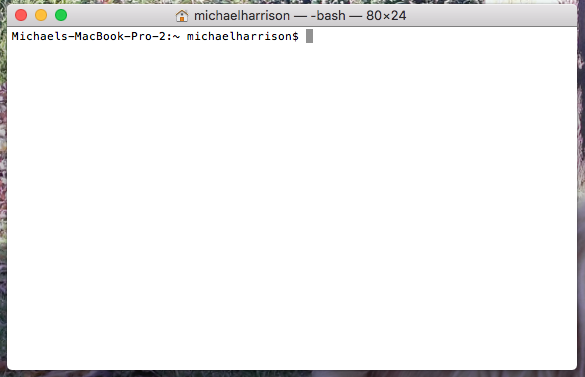
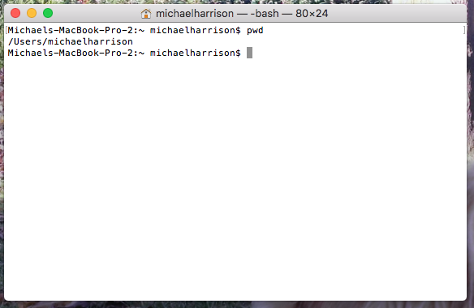

# Week 1 - The Command Line

Learning how to use the command line interface (CLI or *terminal*) is an **essential** skill for any software engineer. It is the primary interface used to interact with your computer, and as such you will be using it every day to accomplish an array of tasks.

You'll learn many things in the coming weeks and months that will be much easier to grasp once you understand how to use the CLI. Installing software, using git, running your code, and even writing code are just some of the things we will be using the CLI for.

A GUI (graphical user interface) is often available as a more accessible, user-friendly way of interacting with the computer - and we will make use of these where appropriate (such as using a nice text editor e.g. VSCode) but it is crucial to be comfortable interacting directly with the computer.

If you think about a car, the interface you use to interact with a car is the steering wheel, the pedals etc. Driving a car with power steering, automatic transmission or cruise control is the equivalent of using a GUI. These things make it a nicer driving experience, but they abstract from what is going on under the bonnet, from how the car actually works. You are here to learn to be a software engineer, and that means being comfortable under the bonnet of the car, knowing how to use a spanner, how to use a screwdriver and when it's best to use one over the other.

You're not required or expected to know everything about the command line by the end of this lesson, It's a brief introduction to give you a basic understanding and to show you where to look for future reference.

## Getting started

To open the CLI on Mac, open up Spotlight (`cmd + space`) and search for "terminal". On Linux, click `Menu > Accessories > Terminal` You should see something like this:

Not a lot to see there. 

The terminal allows you to interact with your computer by *navigating* through the file system, and *executing commands* in the current directory (directory is another word for folder). Executing commands is fairly simple - you type something in, and you get something back.

You can visualize the computers file system as a tree, made of branches and leaves. Each branch (directory) has a parent branch, and each branch can contain child branches, leaves (files), or a mix of the two. The trunk of the tree is just a branch with no parent - this is known as the *root directory* 

The directory your current terminal session is in is known as the *working directory*. You can find out what your working directory is by typing `pwd` (*short for print working directory*) into the terminal, and pressing enter. You should see something like this:

Congratulations! You just executed your first terminal command!

The text that got printed to the terminal is the path to your *home directory*. This is the default directory that the terminal will open in, and it represents your personal part of the computers file system. Everything outside of here is system files.

You don't have to remember the file path of your home directory (you can normally refer to it by the shortcut `~`) - just remember what the home and root directories are. The root has a path of `/`.

## Getting help

With `pwd`, and most of the other commands we're going to cover, you can find out more about each command by using the `man` command.

For example, to find out more about `pwd` type `man pwd`.

You can close this view by pressing `q`.

## [Go to step 2](command-line-2.md)
