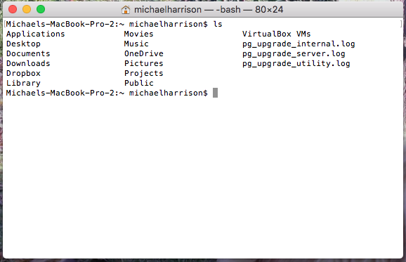
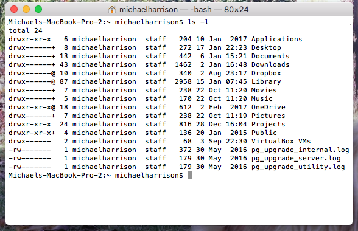

# Command Line - Navigation

Great! We can see where we are. That's pretty useful, but only once (maybe twice if you're forgetful). To make this command infinitely useful, we'll need to be able to move to a different location!

## Listing things with `ls`

So we know that we're in our home directory. And we know that we want to move somewhere. To achieve our aim, we'll need to know where to move to, and what our options are.

Thankfully, typing the command `ls` will give us a list of all of the files and directories in the working directory. Give it a go! It should look like this: 

That's a pretty good selection. But we can only move into a directory, not a file, so we need to be able to find out which of the listed items are directories.

## Using switches

Thankfully, this is easy: We can run the `ls` command we already know, but with a **switch** to modify it's behaviour: 

Many commands will allow you to use switches to alter the behaviour of the command. This just means appending either a single letter or a word prefixed with a single dash (-) or double-dash (--).

Back to the task at hand, running `ls -l` will list the contents of the working directory, but in long format. Give it a go. I get this:

Woah, lots of information. Don't worry about what it all means at the moment (that's coming up shortly...). For now, it's enough to know that the lines beginning with a `d` are directories. For example, the `drwx------+` indicates that `Desktop` is a directory, so lets go there.

### Combining switches / Hidden files
As a side-note, you can pass multiple switches to a command. Try running `ls -l -A`. This should print out the entire contents of your working directory, including hidden files and directories, which are prefixed with a dot.

Files prefixed with a dot get hidden when you go to the directory containing them using the file explorer GUI, to keep things tidy. They are normally used by software packages, and you don't normally need to see them or even know that they're there, but it's good to know that they exist.

As a second side note, you can combine switches into one, and order isn't important, so `ls -l -A` is the same as `ls -lA` and `ls -Al`.

### Listing the contents of a different directory
You can list the contents of any directory by typing the directory's path after the `ls` command. Try seeing what's in your `Desktop` by typing `ls Desktop`. Can you figure out how to list the contents of `Desktop` in long format?

## Changing directory with `cd`

Now we know that `Desktop` is a directory, lets go there! We can change our working directory using the `cd` command. You need to tell it where you want to change to as well, so type `cd Desktop` and once you've run the command, see if you can remember how to print your working directory to see if it worked. You should see something like `/Users/{yourname}/Desktop`.

Got it? Nice work. 

Now we know how to navigate our way down the file tree, but what if we want to get back up a level? The parent filepath to your working directory is represented by `..`, so running `cd ..` will bring you back up a level. Give it a go and then `pwd` should give you `/Users/{yourname}`, back where you were a minute ago.

Another couple of handy shortcuts for navigating are `~` and `/`.

- `cd ~` will bring you back to your home directory from anywhere in the file system
- `cd /` will bring you to your computers root directory from anywhere in the file system

so to navigate to your `Desktop` directory from anywhere, you can type `cd ~/Desktop` or `cd /Users/{yourname}/Desktop`.

This also works with `ls`, or any command that requires a filepath.

## [Go to step 3](command-line-3.md)
