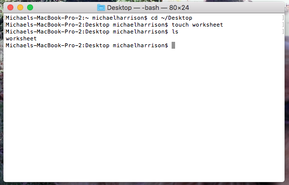

# Command Line - Manipulating Files

## Creating files with `touch`

While changing directories and listing contents is useful, how do we actually create files?

Navigate you your `Desktop` directory and run the following command:

`touch worksheet`

The **touch** command creates an empty file with a given name. In this case it creates a file called *worksheet* in our current directory. If you list out the files in your Desktop, you should now see the new file. (If you look on your actual Desktop, you should be able to see a file icon for the new file too).

Why is the command called `touch`? I have no idea. But make sure you remember it, because it's super useful.

## Deleting files with `rm`

This command has a more obvious name - `rm` stands for remove. You can use it to delete the file you just created - `rm worksheet`.

A word to the wise - it is very difficult to recover a file deleted using `rm` (they don't go into the trash, as you might imagine they would) - so **BE CAREFUL** when using this one.

## Creating directories with `mkdir`

`mkdir` stands for "make directory".
Let's give it a go!

From your Desktop, run `mkdir my-directory`, and then list out the long version of the directory contents. You'll see that there is now a `my-directory` item, and that it is indeed a directory - indicated by the `d` at the beginning of the column.

## Deleting directories with `rmdir`

Another easy command to remember is `rmdir` - "remove directory".

If you run `rmdir my-directory`, the directory you just created should vanish. Magic!

Now do the following using your command line:
- create another new directory on your desktop
- change into that directory
- create a new file in the directory
- change directory back up to your Desktop
- remove the directory you created

What? An error? That's because you can only use `rmdir` to delete empty directories.

To delete a non-empty directory, you can use `rm` with an `-r` flag. This will recursively delete all of the files inside of a directory, including the directory itself. See if you can get rid of that directory now!

There are another couple of useful flags you can use with the `rm` command:
- `-i` - this stands for *interactive* - it will ask you to confirm the deletion of each file. This is obviously useful so that you don't accidentally delete something that you don't want to.
- `-f`- this stands for force, and it will even delete protected files. Another one to be very careful with.

## Copying files with `cp`

Copying files is quite straightforward. The copy command - `cp` - takes two parameters: the file to be copied, and the new file that will be created from it. 

Create a new file called `file1` and then run `cp file1 file2`

If you list the contents of the directory now, you should see both files.

You can also use `cp` to copy a directory and all of it's contents, but you have to use an `-r` (recursive) switch to do so.

## Moving files with `mv`

The command to move a file also takes 2 parameters, the file to move, and the new location for the file.

Create a directory called `my-directory` on your Desktop. We're going to move `file1` created in the previous step into `my-directory` by running `mv file1 my-directory`.

If you run that command and then list out the contents of the Desktop, you should see that `file1` has gone. If you list the contents of `my-directory` you should see it there.

## Renaming files
You can also rename a file using `mv`. If the second parameter you give is a directory, it will move the file into that directory, but if the path doesn't exist, then it will move the file to that location with that name.

If you `cd` into `my-directory` and then run `mv file1 ../renamedFile`, you should see that file1 has gone from `my-directory`, and your Desktop now contains a file called `renamedFile`.

## [Go to step 4](command-line-4.md)
