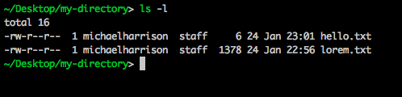
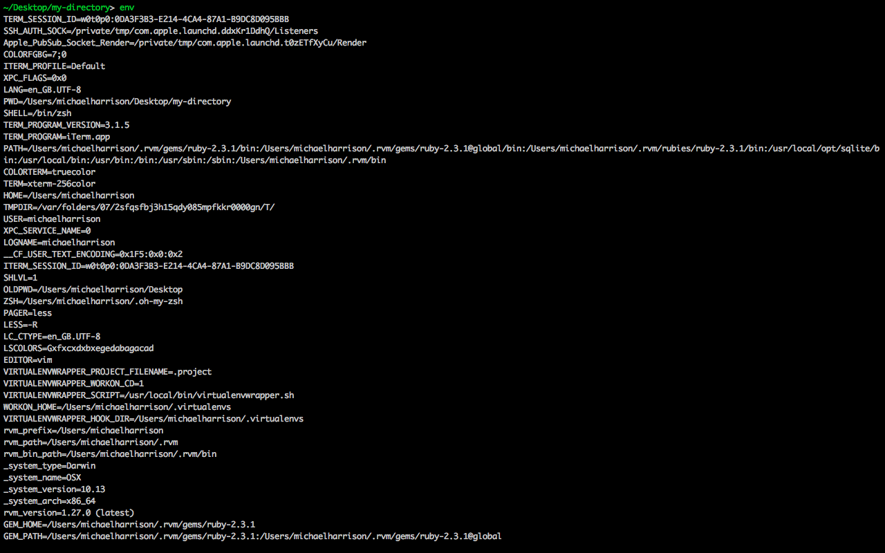

# Command Line - Final boss level

## File permissions

You may remember earlier when you used the `ls -l` command, I promised I would explain what the weird `-rwxr--r--` thing meant. Well, that day is finally here.

Every file and directory on your computer has a set of 3 permissions controlling what can be done to it by different people.

The "read" permission allows a file to be read. When applied to a directory, it allows to list directory's contents, that is, to see the list of files.

The "write" permission allows to write to a file, or, in case of a directory, it allows creating, deleting and renaming files.

The "execute" permission allows to execute a file. For example, in order to run a program, it must have the "execute" permission to be set. If you create a JavaScript file, you won't be able to run it directly unless it has the "execute" permission set. 

Those permissions are broken into 3 classes.



The "User" class determines the permissions that the owner of the file has. Every file on a Unix-like system has some user as an owner. A file can have at most one owner and not more. In the screenshot, the owner is listed in the third column, in this case 'michaelharrison'.

(You can find out what your current username is using `whoami`)

The "Group" class determines the permissions that apply to a group of users. Any user can belong to one or more groups of users (but doesn't have to). For example, if there are several users who access the computer only remotely, they may be organised into a special group that has limited privileges.
In the screenshot, the group that the file belongs to is listed in the 4th column, in this case 'staff'.

The "Others" class applies to all users that don't fall into the other two classes.

In Unix operating systems (e.g. macOS, Ubuntu & Linux), the permissions are not inherited, so if a directory has a "read" permission, it doesn't imply that the files in it are readable as well.

The `-rwxr--r--` thing just explains what the permissions for the file are.

The first character can either be a `d` or a hyphen. `d` means it is a directory, a hyphen means it is a file.

The next three characters are the read, write and execute permissions for the "User" class. `rwx` means that the user has permission to read, write and execute the file.

The next two groups of three characters are the permissions for the "group" and "other" classes respectively. `r--` means that these users only have read permissions on the file. The lack of write and execute permissions is indicated by the hyphen instead of the `w` or `x`

### Changing permissions

The permissions on a file can be edited using the `chmod` command.

To give the group class a write permission on the file "hello.txt", you'd do:

`chmod g+w readme.txt`

Breaking this down:
- `g` stands for group ("u" for user, "o" for others and "a" for all)
- `+` means that we're adding the permission (use `-` to remove it)
- `w` stands for "write". (`r` for read, `x` for execute.)

You can combine several permissions. For example, to remove read and execute permissions from all users:

chmod a-rx readme.txt

## Executables and Shebangs

It's pretty clear what the read and write permissions do, but what about executable?

If you create a file on your Desktop called `hello.js` containing the following text:

```
console.log('Hello World');
```

and then in you terminal run `node hello.js`, you should see the text `Hello World` printed to the terminal.

When you call a terminal command like `ls`, `cat` etc, these are all just bits of software, code that lives somewhere in your computer. When you run the command, that code gets run just like the code in your `hello.js` file did.

So what happens if you try to run `hello.js` in the same way, by calling the file directly?

`./hello.js`

(Don't worry about ./ right now, we'll explain why it's necessary soon.)

You should get a message saying `permission denied: ./hello.js`

The reason we get permission denied error is that the file doesn't have the "executable" permission by default. You tried to execute the code in the file, and you didn't have permission - permission denied!

Verify this is the case using `ls -l`, and then fix it by adding the executable permission to the user class (you can do it!).

If you try to execute the code again, you should see a different error, something like this:

`./hello.js: line 1: syntax error near unexpected token 'Hello World'`

This error is because the terminal doesn't know that it's meant to use JavaScript/Node to understand and execute the file.

From the computer's point of view, you asked it to run a program in the file `hello.js` but you didn't tell the computer what programming language it was. Was it JavaScript? Ruby? Python? Something else? The file does have a 'js' extention hinting that it might be JavaScript but the computer wouldn't make this assumption. The computer needs to be given a specific instruction.

Without this information, the computer will just assume that the file is a "shell script", written in the same language that the command line uses.

If you type `console.log('Hello World')` directly into your command line, you should get the same error message.

To fix this, we can use the gloriously named **shebang**

This is basically a statement you can add to the top of an executable file to tell the computer what tool to use to execute your script.

We want the program to be executed by Node. We can find out where Node lives by typing `which node` - on my computer, this tells me that node is installed at `/usr/local/bin/node`, but it might be different on your own machine.

If you open `hello.js` again and add the following to the top of the file:

`#!/usr/local/bin/node`

next time you run `./hello.js`, it should work like we wanted it to.

You can even get rid of the .js extension, and just call the file `hello`, or even `hello.py` (.py is the normal file extension for Python files), and it should still work the same way.

## `sudo` - Superuser mode

Some actions on the computer require admin privileges. The name of the superuser is "root". If you `ls -l` the `/private/etc` or `/bin` directory where many of the system files are stored, you'll see that all of them are owned by root.

(If you look at `/bin`, you might also notice the files have names like `cd`, `pwd`, `ls`, `mkdir` - these are the executable files for the programs we've been learning about in this tutorial!)

The superuser has read, write and execute permissions on all files on the computer. This effectively means that they can do anything.

This makes working as the super user very dangerous:
- `rm -rf ./*` - this command deletes all of the files in your current directory
- `rf -rf /*` - this typo deletes your entire hard drive.

This is why you normally use the computer as a user with limited permissions (in my case `michaelharrison`), and switch into superuser mode only when you really need to.

To run a command as superuser, you prefix it with `sudo`. You will need to enter your password the first time you run `sudo`.

- `whoami` will print the name of your user
- `sudo whoami` will print `root`

If you remove the read permission from all users on the `hello.js` file you created above (`chmod a-r ./hello.js`) and then try to read it using `less`, you should see a permission denied error like we saw previously.

If you now run `sudo less ./hello.js`, you should be able to read the file, even though your user doesn't have permission to.

## Environment

If you were asked to describe the physical environment you are in, you could come up with things like the city you are in, the time, the weather etc.

If you are working with the command line, you also operate in an environment. For example, the command-line knows where your home folder is, where to find node, what your username is, and many other things. All this information is stored in **environmental variables**.

Environmental variables describe the current terminal session. You can see them by typing `env`.



Every line on this screen is a key/value pair, e.g.

`HOME=/Users/michaelharrison`

The `HOME` env variable defines where the home directory is for the current user. You can easily find variables responsible for setting the username, language, temporary directory, etc.

Every program you run on your computer has access to the environment variables. They help the programs to understand what environment they are working in. For example, if you needed to create a temporary file in your JavaScript code, you'd read the value of the TMPDIR env variable to find out where the temporary directory is.

You can view any single environment variable by typing `echo $ENV_VAR`, e.g.

`echo $HOME` would print `/Users/michaelharrison` to the screen.

**BONUS:** `echo` is a fairly useful command which will print out whatever value you give it - `echo "Hello"` will print `Hello`. This is useful when combined with a redirect `>` to quickly write some text to a file.

### PATH

The `PATH` environment variable is one of the most important ones, so it's worth going into in a little more detail.

It is a colon-seprated list of directories that the terminal will look in to find the commands you ask it to run.

On my computer it look like this:

`/usr/local/bin:/usr/bin:/bin:/usr/sbin:/sbin`

When you type a command without specifying the file path, the terminal will look through each of these directories in order until it finds the file, and then execute it.

You remember before when we looked in the `/bin` file and saw all of those files with the names of the commands we've been learning about, like `ls`? The reason you can run `ls` instead of `/bin/ls` is because `/bin` is in your PATH.

(If you try running `/bin/ls .`, it should have the same effect as `ls .`)

If you move your `hello.js` file to `/usr/local/bin` and rename it from `hello.js` to `hello`, then typing the command `hello` into your terminal should now run the program!

### Setting environment variables

We can also set environment variables, not just read them. Try

`export FAVOURITE_COLOUR=blue`

You've just created a new environment variable called FAVOURITE_COLOUR. You can read its value back.

`echo $FAVOURITE_COLOUR`

What if we wanted to modify PATH? Let's add the home directory to the end of PATH:

`export PATH=$PATH:$HOME`

Why would we want to modify environmental variables? One of the common use cases is storing sensitive data, e.g. passwords.

Let's say you're writing an open source project that uses photos from Facebook. Your code will need to use a secret key that will give you access to Facebook. This key is secret and you shouldn't share it with anyone. However, you want to share your code publicly on Github. How should you do it?

Put your secret key in an environment variable and then read it from your code when you need it. For example:

`export SECRET_KEY=12345abcde`

Then, in your JavaScript code, read the value:

`const secretKey = process.env.SECRET_KEY`

This way you'll be able to share your code with anyone without compromising your keys.
