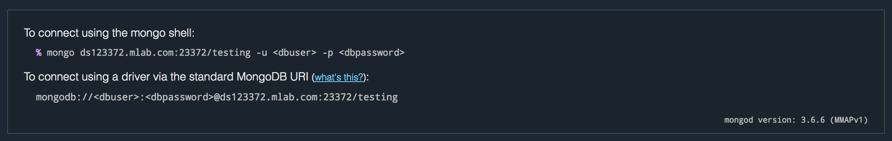

# mLab

[mLab](https://mlab.com/) is a Database-as-a-Service, which essentially means they host and manage databases for us so we don't have to. The database they host is [MongoDB](https://en.wikipedia.org/wiki/MongoDB), which is a _document_ based database. It has documents, which are like JSON objects, and these are grouped into collections e.g products, carManufacturers or users.

We can get started on mLab for free with their Sandbox plan (good for development, not good for production (deployed) applications).

## Get Started

* [Sign up with mLab](https://mlab.com/signup/).
* Verify your email address, then [create a new database](https://mlab.com/create/wizard#PlanType-Provider).
* Choose Amazon Web Services as the cloud provider (should be selected by default).
* Choose the Sandbox plan and click `Continue` in the bottom right corner.
* For the region, choose `Europe (Ireland) (eu-west-1)` (we choose the location nearer to us to reduce _latency_ - that is how far the data physically has to travel to reach us) and click `Continue`.
* Give your database a name (relevant to the project you're working on) and click `Continue`.
* You'll see an overview of the options you've selected so far. Check everything over and click `Submit Order`.
* Your database should show up in a table. Wait for it to finish processing (a green tick should appear) and then click it.
* This should take you to the details page. Click on the Users tab, and click the `Add database user` button.
* Give your database user a username and a password. Be sure to make a note of these credentials as you won't be able to retrieve the password later.
* Click `Create`.

Voila! Now we can talk to our database. 🎉

## Database connection string

You will likely need a database connection string so your application can connect to the database. You can find it on the database detail page at the top:

You'll want the string underneath `To connect using a driver via the standard MongoDB URI:`. Replace `<dbuser>` and `<dbpassword>` with the username and password you set earlier when you created a database user.
