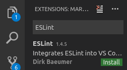
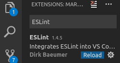

# Installing ESLint

## What is ESLint?

[ESLint](https://eslint.org/) is a linter. Linters go through your code and look for mistakes such as undefined variables or reassigned constants. They are more powerful though when combined with a style guide - a preset wich dictates how code should be written (spacing, use of semicolons etc.).

Throughout the course, we'll be using ESLint with the [MCR Codes custom styleguide](https://www.npmjs.com/package/eslint-config-mcr-codes).

## Installing ESLint

Open a Terminal and enter the following:

```bash
npm install -g eslint
```

## Installing the VS Code extension

1. Open VS Code.
2. Click the Extensions icon: 


3. In the search box, enter ESLint and click Install (in green) on the top result:



4. Then once installed click `Reload`:


