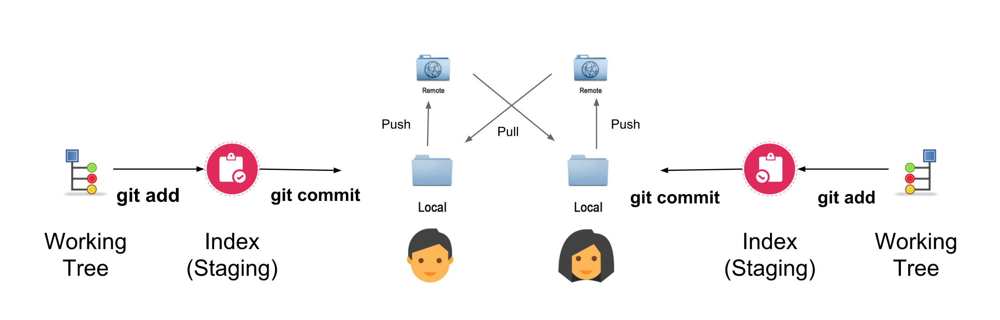

# Git Pairing (Git Pong)



Throughout the course we will be using Git in pairs to collaborate on a piece of work. 

During the pairing flow it will work as follows:

:one: Each person in a pair will configure their local repositoriy to point to a) their GitHub remote (which they will name origin) and b) their partner's GitHub remote (use the partner's username):

```bash
git remote add origin git@github.com:<your_username>/<your_repository>.git
git remote add <partners_username> git@github.com:<partners_username>/<partners_repository>.git
```

**NOTE:** If you clone down an existing repository that you've forked to your own remote, then you won't need to create a link to remote for `origin`, only your partner's remote repository.

:two: When it is time for the _driver_ and _navigator_ to swap roles, the _driver_ will add, commit and push their code up to GitHub:

```bash
git add <modified_file>
git commit -m "<appropriate_message_detailing_changes>"
git push origin master
```

**NOTE:** You may or may not need to specify an upstream flag (`-u`) during the `git push`. Git will tell you if you do (usually if you haven't forked an existing remote) following execution of the command.

:three: After you have swapped roles, the new driver will pull down from the now navigator's remote. 

```bash
git pull <partners_username> master
```

:four: The navigator will then repeat step 2, partners will swap roles, and the now navigator will repeat step 3.
