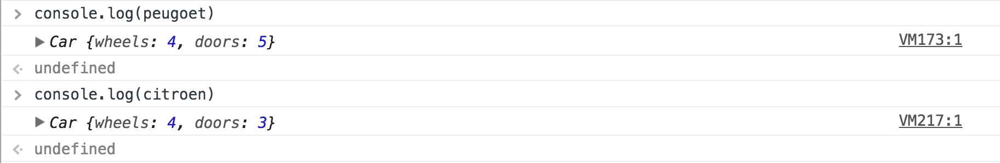
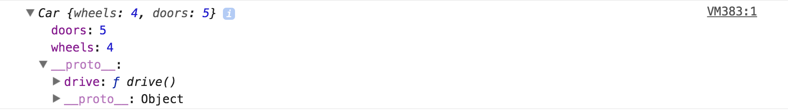

# Prototype / Constructor

First read [:zap: Objects](./objects.md).

Take a look at the following scenario:

```js
const honda = {
  wheels: 4,
  doors: 5,
  drive () {
    console.log('vroom')
  }
}

const citroen = {
  wheels: 4,
  doors: 3,
  drive () {
    console.log('vroom')
  }
}
```

We have 2 cars. Both have the exact same methods and properties but differing property values. In this scenario, there are downsides to creating objects in this way:

* We have to keep repeating ourselves each time we make a car. 
* If we spell a property name wrong on say the `citroen` then our application might not work correctly when we come to use the object.
* The `drive` method will be exactly the same for each car, yet we're storing it multiple times in memory.

## :car: A different approach to building a car

We know that both `citroen` and `peugoet` are cars, so what if there was a way we could create a scaffold for what a car is, and then just create `citroen` and `peugoet` from that scaffold? Fortunately, the Prototype / Constructor pattern in JavaScript allows us to do this.

Let's take a look:

```js
function Car (wheels, doors) {
  this.wheels = wheels
  this.doors = doors
}
```

This is referred to as a _constructor_. When called with the `new` keyword, a new object is created in memory, which the `this` keyword is bound to (so we can add properties to the object as above). Let's see how we can use this constructor to make a `Car`:

```js
const peugoet = new Car(4, 5)
const citroen = new Car(4, 3)
```

When we use the `new` keyword, we create a new _instance_ of `Car`.

If you `console.log` out `peugoet` and `citroen` you get:



If you're observant, you may have noticed I've excluded the `drive` method. This is because I _could_ add a method like so:

```js
function Car (wheels, doors) {
  this.wheels = wheels
  this.doors = doors
  this.drive = function () {
    console.log('vroom')
  }
}
```

**But** there is a more efficient way. Introducing the _prototype_:

```js
function Car (wheels, doors) {
  this.wheels = wheels
  this.doors = doors
}

Car.prototype = {
  drive () {
    console.log('vroom')
  }
}
```

If we create a new `peugoet` and a new `citroen` now and we `console.log` them out we get the same again:


You can see that we have the exact same properties as before. As before, it's still possible to access these properties via dot notation. But...but where is the `drive` method!? If you click down into the object you will see a `__proto__` key. If you click down into this, you should see the `drive` method:



What's happening here is that we have 2 object instances that have their own properties (`wheels` and `doors`) but they inherit their methods from their parent's (`Car`) prototype. This inheriting of methods from a parent object is referred to as _inheritance_. You can still call `peugoet.drive()` - JavaScript will look to the prototype of the object (`__proto__`) to find the method if it can't find it on the object itself. 

In other words:

* A _constructor_ allows us to create a scaffold for what the properties on a new object should look like. These properties belong to the object instance.
* A _prototype_ allows us to specify methods which are to be shared across new object instances. These methods belong to the object instance's parent (in this scenario `Car`).

## Private properties/methods

There are some properties and methods that we want to tell other developers and users it's not okay to access directly (because we want to control what is and isn't available outside of the object's prototype). For example, imagine if the NHS made patient data from its Trusts available for researchers to use. Perhaps we have an object called `Trust`:

```js
function Trust (name, location, medicalRecords) {
  this.name = name
  this.location = location
  this.medicalRecords = medicalRecords
}
```

Now imagine a new Trust has opened in a city :hospital: , and 3 patients from another Trust have been transferred across. We might instantiate this Trust like so:

```js
const uhcw = new Trust('UHCW', 'Coventry', [
  {
    patient: 'Murray',
    conditions: ['Anxiety']
  },
  {
    patient: 'Lucia',
    conditions: ['Diabetes', 'Fibromyalgia']
  },
  {
    patient: 'Tiger',
    conditions: ['Liver Disease']
  }
])
```

If we as the NHS want to share data with researchers, the last thing we want to allow is for somebody to do:

```js
uhcw.medicalRecords
```

As this will provide them not only with the medical conditions, but with identifying information for each patient. To work around this, we can name our `medicalRecords` property with an underscore `_`. This will signify that this property shouldn't be accessed from outside the object:

```js
function Trust (name, location, medicalRecords) {
  this.name = name
  this.location = location
  this._medicalRecords = medicalRecords
}
```

Now we can make a method on the prototype so that researchers can get only the information they need from each Trust:

```js
Trust.prototype = {
  getMedicalRecords () {
    return this._medicalRecords.map(medicalRecord => medicalRecord.conditions)
  }
}
```

Researchers can now call `uhcw.getMedicalRecords()` without patient data being compromised.

### A couple of things to note

Private doesn't exist properly in JavaScript. It is still possible to call `uhcw._medicalRecords`. We use `_` to signify to other developers that they shouldn't be accessing properties (and methods) directly in this way. In other languages, the concept of _private_ is enforced more strictly, so it's something to be aware of (especially as you may end up working in a different language).

It's also worth mentioning that you can use the same `_` convention to create private methods on a prototype (that would be called by the prototype's other _public_ methods).

## A more practical example of Prototype / Constructor

Let's say we have a cash machine. Cash machines generally exist in number (there are _apparently_ 3.5 million of them worldwide), and aside from things like where they are located and which bank they belong to, they all have the same functionality - they allow us to withdraw money and to view our statements.

So what changes from one cash machine to another?

* `bank`
* `location`

These will be our properties. We can therefore go on to make our constructor:

```js
function CashMachine (bank, location) {
  this.bank = bank
  this.location = location
}
```

What about withdrawals? It's safe to say that one cash machine won't have the exact same withdrawals as another cash machine. Withdrawals is also plural, which insinuates we might want to consider an array. Let's add one more property to keep track of these. We'll make it a _private_ property so we can limit the user of `CashMachine` to only be able to view their own withdrawals:

```js
function CashMachine (bank, location) {
  this.bank = bank
  this.location = location
  this._withdrawals = []
}
```

Now, what doesn't change from one cash machine to another? Our functionality:

* `withdraw`
* `viewStatement`

This functionality will sit on the `CashMachine` prototype, for all new `CashMachine` instances to access:

```js
CashMachine.prototype = {
  withdraw (cardNumber, amount) {
    this._withdrawals.push({
      cardNumber: cardNumber,
      amount: amount
    })
  },
  viewStatement (cardNumber) {
    return this._withdrawals.filter(withdrawal => withdrawal.cardNumber === cardNumber)
  }
}
```

It's assumed that cash machines will be used by multiple users, so a `cardNumber` field is added to all withdrawals to uniquely identify each user.

Here we use `this` to access the `_withdrawals` property on an object's instance, which is an array. In `viewStatement` we [filter](arrays/filter.md) these results so the user of the `CashMachine` can only view their transactions.

## Additonal Reading

The Prototype / Constructor concept is a difficult one to grasp at first, but keep going at it and it will become much clearer. Here are some additional reading materials that may help (would recommend reading in order):

* [Create objects in JavaScript](https://hackernoon.com/create-objects-in-javascript-10924cfa9fc7)
* [Prototypes in JavaScript](https://hackernoon.com/prototypes-in-javascript-5bba2990e04b)
* [JavaScript Constructors and Prototypes](http://tobyho.com/2010/11/22/javascript-constructors-and/)
