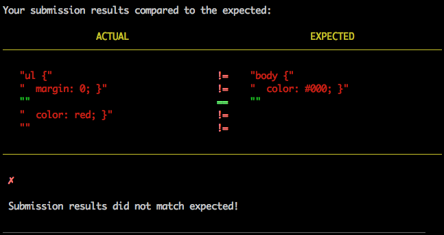
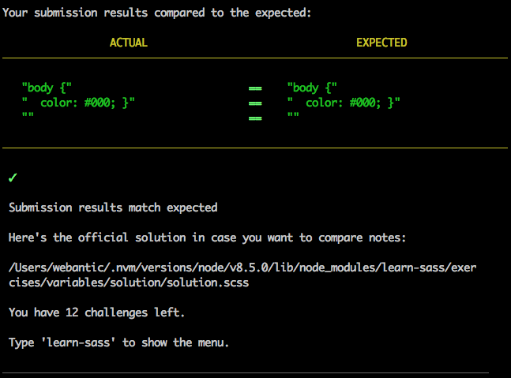

# Sass

## What is Sass

_Sass_ is what is known as a _CSS preprocessor_ - effectively a layer on top of CSS that allows us to use features that don't exist in CSS yet. We write our code in Sass, run it through the Sass compiler which translates our fancy Sass markup into ordinary CSS, and this gets piped into a new CSS file.

Read about some of the Sass features [here](https://sass-lang.com/guide).

## `learn-sass`

To teach you the basics of Sass, there's a really useful npm package called `learn-sass`. To install it run:

```bash
npm install -g learn-sass
```

Once you've installed, create a project folder called `learn-sass`.

Run `learn-sass` by in the Terminal:

```bash
learn-sass
```

I would recommend initialising a Git repository too, committing at the end of every exercise and pushing up to a remote when you're done.

Start with `VARIABLES`. You'll get given some instructions to create a `.scss` file. The example specifies `stylesheet.scss` but you should name your file after the name of the exercise, so for `VARIABLES` you should create a file called `variables.scss` and to verify the exercise you would run:

```bash
learn-sass verify variables.scss
```

When you run this command, `learn-sass` calls the Sass compiler and compares the outputted CSS to it's own expected value. If you haven't completed the exercise properly, you'll get something along the lines of:



If you have completed the exercise you'll get:



Once you've completed the exercise, move onto the next one - remember to name your files after each exercise so you can keep track of all of your solutions.

## Done? Put it into action

### Installing Sass

Firstly we need to install the Sass compiler:

#### Linux

```bash
sudo apt-get install ruby-full build-essential rubygems
sudo gem install sass
sass -v # check it works
```

#### Mac

```bash
gem install sass
sass -v # check it works
```

### Writing Sass

Identify areas from the CSS track where perhaps you could use Sass's features to make your code more concise. You'll want to put your Sass code into a file called `main.scss`, which should sit in the same folder as your `main.css` file. Inside your project folder, run the following in a Terminal tab, and keep it active in the background:

```bash
sass --watch main.scss main.css
```

This will keep watching your `main.css` file for changes, and everytime you save the file it will translate the Sass code to CSS, outputting that CSS to `main.css`. Have a look at both files to see how Sass has translated your Sass code!

## Recommended Reading

- [Why Sass?](https://alistapart.com/article/why-sass)
- [Sass on Codecademy](https://www.codecademy.com/learn/learn-sass)
