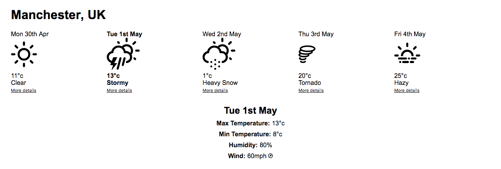

# - Intro to React & Weather App

Over the next couple of weeks we are going to be covering React, a popular front-end framework for building user interfaces.

Before you go any further, read this byte: [:zap: What is React?](https://github.com/kirstydevlin1/recode-course/blob/master/Bytes/react/what-is-react.md)

This is an intense 2 day block - as you will see below, we have a large number of different concepts to cover. Please make all necessary arrangements to ensure you can dedicate as much time to this as possible.

## Learning objectives

To be able to answer "yes" to the following questions:

- Can you explain what React is?
- Do you know the difference between JSX and HTML?
- Can you explain the difference between state and props?
- Do you know how events work and how to handle them?
- Can you make a request to a server and process the response data?
- Can you handle errors in JavaScript?

## Bonus :star:

- Can you test a component using Enzyme?

## Concepts
- React
- JSX
- Props
- State
- Container components
- Stateless (presentational) components
- Request/Response
- Error Handling
- Enzyme

## Recommended Reading

It's **strongly** recommended that you do go through both of these Codecademy tracks in addition to the lectures and the walkthroughs. It's another approach to learning that will - from experience with past students - ensure you have a strong foundation in React. Try and do part 1 on the day off, and look to do part 2 over the weekend.

* [Codecademy: Learn React Part 1](https://www.codecademy.com/learn/react-101)
* [Codecademy: Learn React Part 2](https://www.codecademy.com/learn/react-102)

## Challenge :cloud:

We will be making a weather forecasting application, which will look something like this:

Nice.

This is a 2-3 day project so please take time to understand the concepts.

**DO:**
* Take time to do the Codecademy tracks, and to read any recommended reading.
* Try and give each step a go without the accompanying walkthrough.
* Go over the walkthrough after (read it carefully).

**DON'T:**
* Skip Codecademy or the reading materials.
* Copy and paste.
* Selectively read the walkthroughs.

## Pairing

We won't be providing formal pairing instructions going forward. When you come to clone down our pre-made React boilerplate (more on this later), you will want to initialise a Git repository inside of it, before proceeding to set up your remotes. Please look at the [:zap: Git Pairing](../bytes/git/git-pong.md) byte to remind yourselves on how to do this.

## [Get Started](contents.md)
