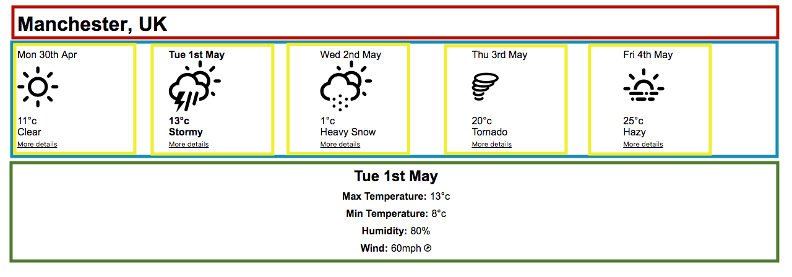

# Step 4 - Solution

Looking at the screenshot of the UI we want to build, I would say that we could break the application down into 4 logical components, like this:

* `LocationDetails` - the name and country of the city the forecast is for (red outline)
* `ForecastSummaries` - a list of forecast summaries (blue)
* `ForecastSummary` - a card with the summary of the forecast for a particular day (yellow)
* `ForecastDetails` - contains the full details of the forecast for the selected day

These components each have a clear and distinct responsibility.

In terms of props:

* `LocationDetails` needs the city and country that the forecast is for, so would have a `city` and a `country` prop. These would come from the `location` object in `forecast.json`.
* `ForecastSummaries` needs a list of forecasts to summarise - so we would have a prop called `forecasts`, which would be an array - the `forecasts` attribute from `forecast.json`
* `ForecastSummary` needs details about the date, the temperature, the description and which icon it should display. So we would have `date`, `temperature`, `description` and `icon` props, which would come from the corresponding attributes on the JSON data.
* `ForecastDetails` needs details about the date, the temperature, the wind and humidity for the selected date. So we would have `date`, `temperature`, `wind` and `humidity` props. Again, this is all available in the JSON data.

## [Next Step: Rendering the location details](../step-5.md)
