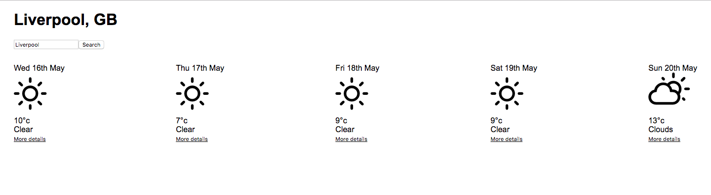

# Step 16 - Adding Search Functionality

We have live data coming into our Weather App, but it's always for Manchester :rain_cloud:

The next feature we are going to implement is to add search functionality to the app. We will be able to enter a city name into a text box. When we click the submit button, it will make a new request for weather data for that city, and update the UI with the returned data.

Look at all that sunshine in Liverpool.

So far in the app, all of the components we have made have been fairly custom, by which I mean they have a specific function which is unique to our app. One clue that we have done this is in the component names (`ForecastSummary`, `ForecastDetails`). This is quite a common thing to happen when making presentational components, who's job is to lay out some data.

In this challenge, however, we are going to be making a `SearchForm` component who's primary job is not simply presentational. For components like this, where the main thing we are interested in is the functionality they bring, then it's good to try to encapsulate that behaviour as generically as possible.

So what is that behaviour?

- We want to be able to enter text in the text field.
- When we click the submit button, we want something to happen with the value that we entered into the form.

In this case, that *something* is that we want to use the text we have entered to make a request for the data from that city. But in general, the behaviour of a search form is just that we want to do something with the search value - the something is defined by the context in which we use the form, and isn't something we actually need to worry about.

Let's start by making the basic layout of the form:

- Create a new file, and create a new component `SearchForm` in this file
- In this component, render a text input, and a button. Give the button the text 'Search'.
- Render this component in your `App` component, between the `LocationDetails` and `ForecastSummaries`

You should now see the form on your page in the browser.

The next thing we wanted to implement was to be able to enter text into the input field. You should already be able to do this if you try.

However, the next requirement requires us to do something with that value. At the moment, when text is entered into the text box, we have no way of referencing the value in the text box. To be able to use the value, we first need to capture that value in the components state.

To do this we need to add an `onChange` event handler function to the text input. Convert your `Search` component to a class component (if it isn't already one), and add a method called `handleInputChange`, which just `console.log`s some message.

**Bind** this method to the component in the constructor, and pass it into the `input` element as an `onChange` prop.

Now in your browser, when you enter some text into the input field, you should see your message being logged to the browser console.

So how do we get the value of the text entered into the input field? When an event handler function is called, it receives as a parameter an **event** object, which describes exactly the event that triggered the function.

This event object has 99% information that you will probably never need. Most of the time, you will be interested in in the element that triggered the event (the `input` field), and - more specifically - the value contained within that element (the text). We can access the dom element that triggered the event by referring to `event.target`. We can access the value of this element by accessing its `value` property.

Give your `handleInputChange` method a parameter called `event`, and then instead of logging a message, log `event.target.value`.  

Now when you type into the box, you should see the text you type being logged to the console.

Now we need to store this value in state:

- In the `constructor` of your component, create a property in the initial state called `searchText` and set it to an empty string.
- In `handleInputChange`, use set the value of `searchText` in state to be equal to the text entered into the search box.
- Add a `value` prop to the `input` element, with a value of `searchText` from state.

The text entered into the search box is now stored in your components state. We now just have to use that value to make a request to the API.

We want the request to be sent when we click on the "Search" button, so we need to add an `onClick` event handler to the `button` element.

However, there is a difference between this task and the previous one. Previously, when we tracked the value in the input field, we set the value in the state of the `Search` component itself. Everything was internal to the `Search` component.

In this example, we want clicking the button in `Search` to set the `forecasts` and `location` state - which belongs in `App`. We have actually seen this problem before - the `selectedDate` state is stored in `App`, but is actually updated by an event triggered in `ForecastSummary`.

We also know how to make requests using axios.

For the last step, you need to:
- write a function that makes a request to the API for the data for a specific city, and sets the data to state in the `App` component.
- Have this function be triggered with the text from the input field when the search button is clicked in `Search`.

Once you have done this, you should be able to search for any city in the UK, and see the latest weather forecast.

Looking through your code, can you see any places where you have repeated yourself? Try and refactor to make your code a little cleaner.

There is only one outstanding thing to fix now: Try and search for "ssdgfd" (for example) - noting should happen, but you should receive an error message in the terminal.

In the next step, we will look at handling these errors, and displaying a user-friendly message instead.

## Recommended Reading

* [Events](https://developer.mozilla.org/en-US/docs/Web/API/Event)

## [Next Step: Error Handling](step-17.md)
