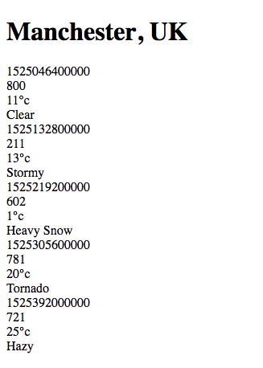

# Step 9 - CSS in React

Your app should now look something like this:



Not going to win any prizes soon.

In this step, we're going to look at adding some CSS to our React app.

With a normal HTML page, we would require in any stylesheets in a `<style>` tag in the documents `<head>` tag.

Using React (more accurately using Webpack), we can require our css files into our JavaScript directly. Even better, we can break our css files down by component and require in the styles for the component in that component. With CSS, it is very easy to write a long, long, unmanageable mess, so this is a good way to avoid that.

To start, create a new directory `src/styles` and add a file into it called `app.scss`

In your `App` component, make sure the top level `div` has a `className` prop of `"forecast"`, and then in your `app.scss` file write some css which does the following:

- targets the `forecast` class
- sets a left and right margin of `20px`
- sets the font family to `Arial, Helvetica, sans-serif`

Once you've done that, you can just import the css file into your `App` component:

```js
import React from 'react';
import PropTypes from 'prop-types';

import LocationDetails from './location-details';
import ForecastSummaries from './forecast-summaries';

import '../styles/app.scss';
```

Try and add another stylesheet, `forecast-summaries.scss`, which targets the `forecast-summaries` class, and applies the following rules:

- `display: flex`
- `justify-content: space-between`

Import that into `ForecastSummaries`, and suddenly your application should look a lot nicer.

Take a look at the `head` tag of the your html in the browser dev tools - you'll see a couple of `<style>` tags. If you compare this to the `index.html` file in your repo, there is no reference to any stylesheets in that file. These style tags have been dynamically injected into the DOM by webpack, and contain the styles from your stylesheets.

If you're feeling adventurous, take a look at the `webpack-config.js` file - can you see how we are loading in the scss files using webpack?

One problem with this approach is that our tests do not use Webpack. If you run the test, you should get `SyntaxError: Invalid or unexpected token`. When we load our components in our tests, Jest doesn't know how to deal with these files, as they are not JavaScript files.

To fix this, create a file in the `__jest__` directory called `stub.js` with the following code:

```js
const stub = {};

export default stub;
```

and add the following code to the `jest` property in the `package.json` file:

```json
"moduleNameMapper": {
  "^.+\\.s?css$": "<rootDir>/__jest__/stub.js"
}
```

This says to Jest "when you have to load a module with a filename ending in .css or .scss, actually load the `stub.js` file". The stub file returns an empty object, which IS valid JavaScript, and our tests can continue.

## Recommended Reading
- [Webpack loaders](https://webpack.js.org/concepts/#loaders)

## [Walkthrough](solutions/step-9.md)
## [Next Step: Testing rendered components](step-10.md)
