# FizzBuzz - How To

Inside the root folder of your local `diy-kata` repository, type `code .` to open up VS Code with the project files.

Take a look in `__tests__/kata1.fizzBuzz.test.js`:

This is the code for your tests (where you will write your expectations and assertions).

And now take a look in `src/kata1.fizzBuzz.js`:

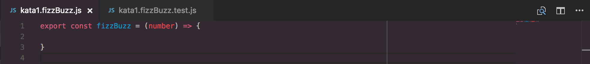

This is the code for your function (where you'll write the code that passes the tests - don't do it yet though!).

Let's start with the first expectation:

How might we approach this? When we invoke our function with an argument of `3`, the test should `expect` the return value `toBe` `Fizz`. Let's see how that translates in code:

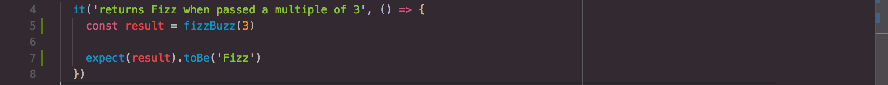

You could easily read too deeply into what's going on here, but actually it reads quite nicely: `expect the result of fizzBuzz (with 3 passed as an argument) to be a string of 'Fizz'`.

There's no need in this case to assign the result of `fizzBuzz` to a variable either. Because JavaScript gives precedence to values wrapped in parentheses, we can simply do:

The `3` gets evaluated first (to `3`). Then `fizzBuzz(3)` gets evaluated next (when we write the code, it should evaluate to `Fizz`), and then `Fizz` (inside `toBe()`) gets evaluated to `Fizz`.

Now imagine these evaluations have taken place. What's actually happening when our tests pass is: `expect 'Fizz' to be 'Fizz'`.

Okay, enough explaining! Let's run our test suite:

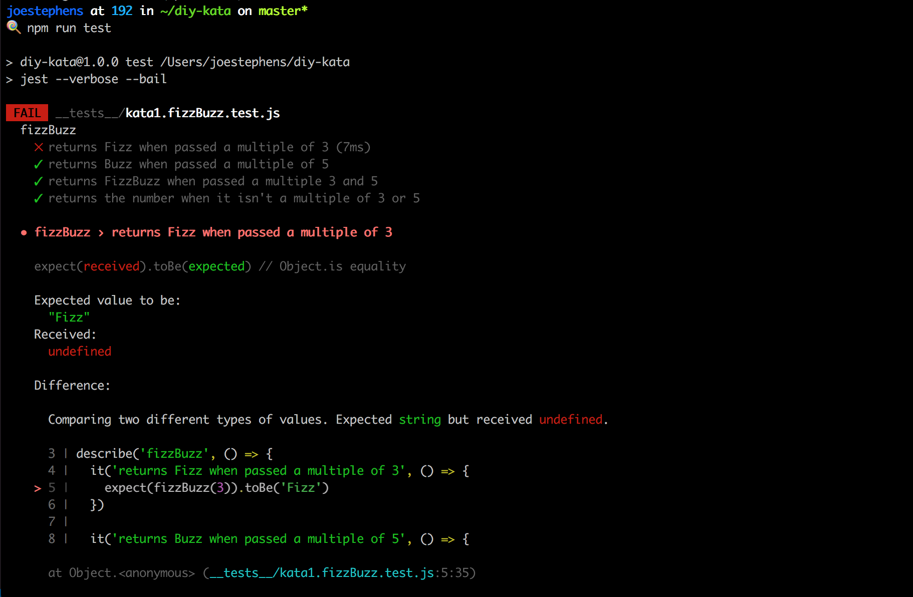

Start from the top. You'll notice 3 of the tests are passing - don't be fooled! They're passing because there are no expectations or assertions inside the test blocks, which means the test is allowed to execute from start to finish (and thus passes).

However, our first test *_is_* failing. Let's go in closer:

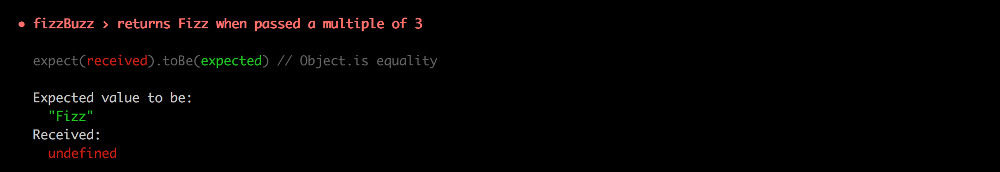

It's telling us that our `fizzBuzz(3)` has returned `undefined` so the test has received `undefined` when it expected `'Fizz'` and therefore it fails. Now we can write the code to pass the test!

Let's go back to `src/kata1.fizzBuzz.js`:

All we are concerned about at this moment in time is making our test pass _without any further modification to the test itself_. Our test received `undefined` and it wanted `Fizz`, so lets give it a Valentines treat :cupid: :

Now you've wrote some code, why not run your tests again?:

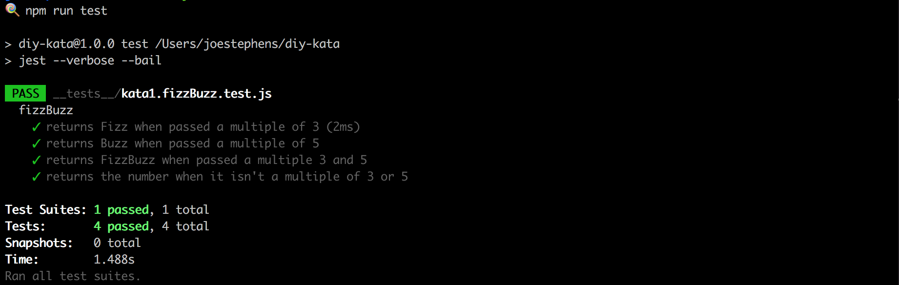

Great, our first test passes. Our other 3 do as well though, which is really misleading. Wouldn't it be great if we could have them specced out like we do currently, but without them getting in the way? Fortunately we can, by swapping out the `it` method for `xit` on test specs we want to ignore (I like to think of it as `x`ing (crossing) them out:

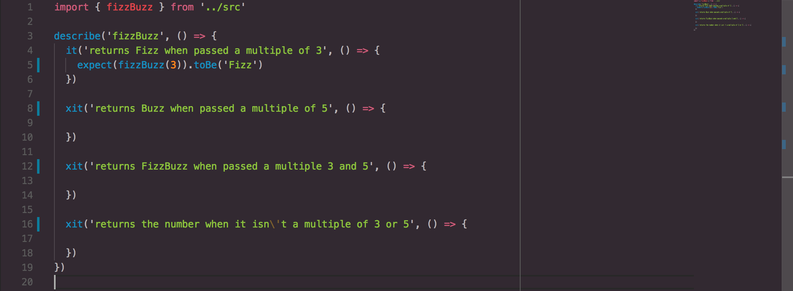

Run your tests again:

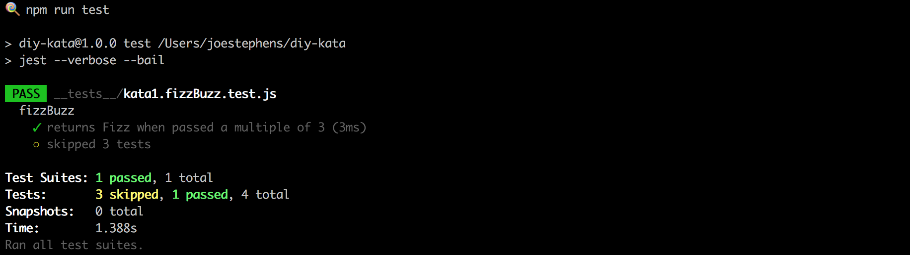

Much better. Just remember that every time you jump onto a new spec, you'll need to change the `xit` back to `it` or it will be ignored. 

Lets add an expectation and assertion for our next spec `returns Buzz when passed a multiple of 5`:

It should fail with:

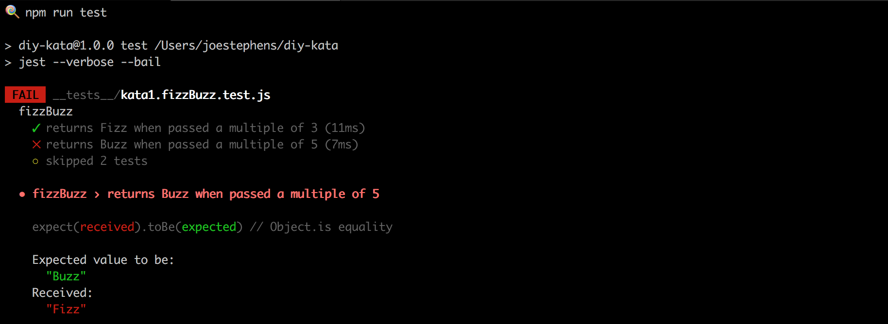

Of course it doesn't work - `fizzBuzz` always returns `Fizz` in its current state. Lets add a little more logic to our function expression:

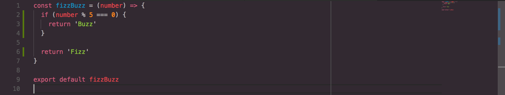

We say that if `5` goes into `number` with a remainder of `0` then we'll `return` out of our function early with `'Buzz'`. 

Both tests should now pass:

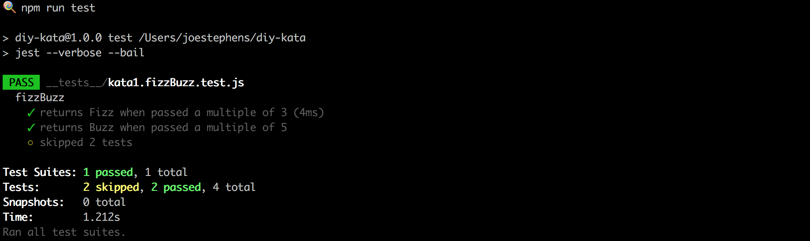

Okay, again for `returns FizzBuzz when passed a multiple of 3 and 5`:

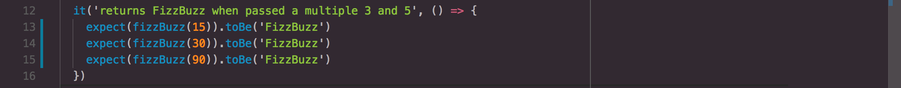

Notice we have three expectations. This is often good practice to do to ensure your units (functions / methods) are tested with a variation of inputs.

Run the tests:

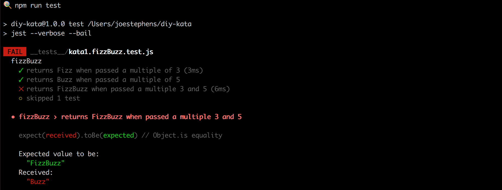 

Now the code to pass:

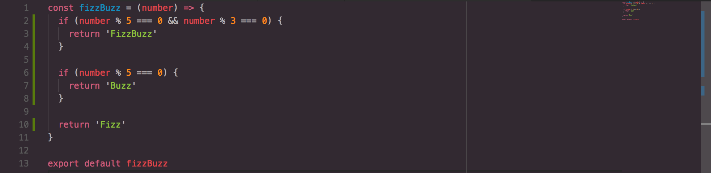

Your tests should pass. 

**Do you understand what's going on here?**

**What do you think would happen if you swapped the `if` statements?**

Okay, last one: `returns the number when it isn't a multiple of 3 or 5`.

Test:

Code:

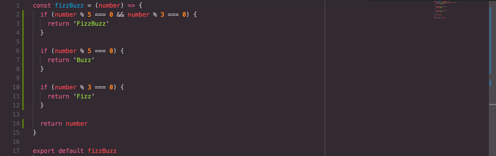

Whoomph! There It Is :musical_note: :

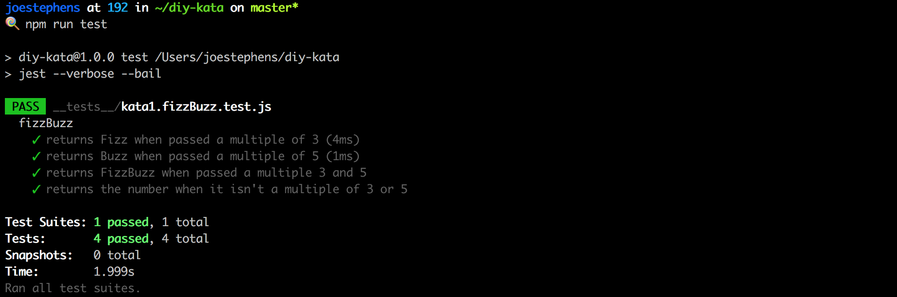

Now I'm confident all of the tests are passing I'm going to go in for a cheeky refactor in the knowledge that if I break the code, the tests will fail. I've noticed an opportunity to DRY (Don't Repeat Yourself) the code up and to make it more readable:

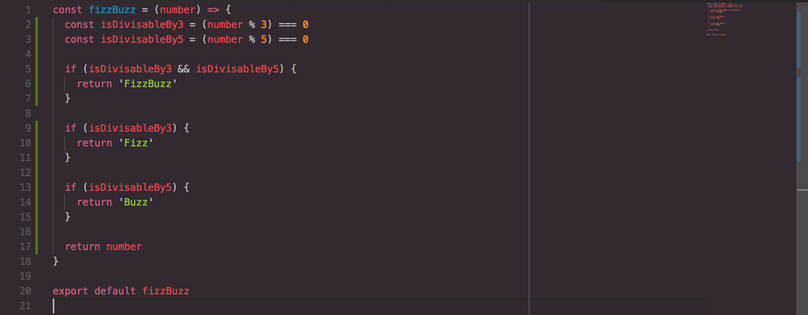

And... :white_check_mark: :white_check_mark: :white_check_mark: :white_check_mark:

***
:bulb:

There are many solutions to the FizzBuzz problem. Mine might not be the best way. Maybe you can think of a different approach?
***

## [Next Challenge: Boolean to word](step2.md)
